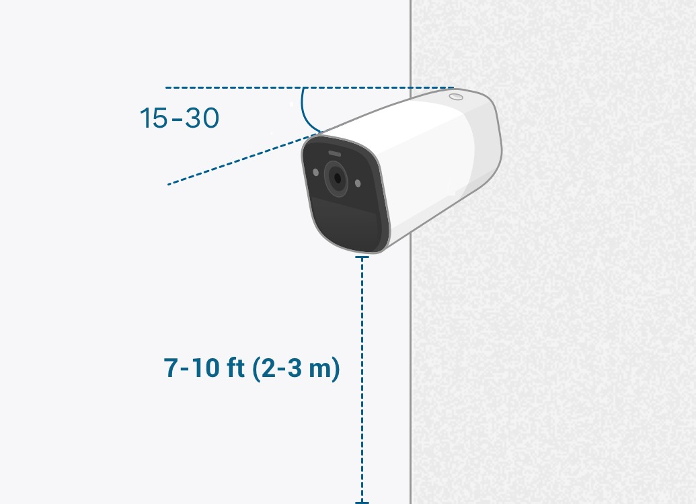

# Facial Recognition Camera Installation Guide

This document provides best practices and installation guidelines for setting up cameras in a facial recognition system. Proper camera placement, lighting, and calibration are critical for achieving accurate and consistent recognition results.

---

## 1. Introduction

Facial recognition performance depends heavily on camera setup and environmental conditions. The following guidelines ensure optimal camera installation for reliable face detection and recognition.

---

## 2. Camera Positioning

### Mounting Height

- Recommended indoor mounting height: **2.5 – 3.0 meters (8–10 feet)**.
- The optimal height for facial recognition is around **2.8 meters**, allowing a clear view of the face and shoulders.
- In outdoor installations, consider security and maintenance accessibility.

### Tilt Angle

- The camera should be angled **15–30 degrees downward** to capture the upper body and face area clearly.
- Avoid excessive downward tilt — faces should be fully visible, not just the tops of heads.
- The camera should face the direction of pedestrian movement whenever possible.

### Placement Relative to Movement

- Position cameras so that people approach the camera rather than walking across its field of view.
- Avoid overly distant or high mounting positions that reduce face size in the image frame.

---

## 3. Lighting Conditions

### Uniform Illumination

- Use **soft, even lighting** to avoid harsh shadows or glare on faces.
- Prevent direct light from shining into the camera lens.
- Avoid strong backlighting (e.g., sunlight or bright windows behind subjects).

### Brightness Levels

- Ensure sufficient illumination — **ideally above 200 lux** for accurate recognition.
- In low-light or night environments, use cameras with **low-light or IR capabilities**.

### Background and Environment

- Maintain a **simple, non-reflective background** to reduce false detections.
- Avoid placing cameras facing glass walls, mirrors, or strong reflective surfaces.

---

## 4. Lens, Resolution, and Distance

### Image Resolution

- The face should occupy at least **200 × 200 pixels** within the frame for accurate recognition.
- Ensure the system’s “pixels per face” (PPF) is sufficient for the recognition algorithm.

### Camera Distance

- Maintain a moderate distance from the expected subject location to ensure faces are large enough in the frame.
- For fast-moving subjects, ensure the camera’s shutter speed and frame rate minimize motion blur.

### Lens Selection

- Avoid ultra-wide-angle lenses when possible, as they make faces appear too small.
- Choose a focal length that balances field coverage with sufficient facial detail.

---

## 5. Physical Installation and Maintenance

### Mount Stability

- Ensure the mounting bracket is **rigid and vibration-free**. Even small movements can blur the image.
- Protect outdoor cables and connectors from rain, sunlight, and corrosion.

### Accessibility

- Camera lenses should be cleaned periodically to remove dust and smudges.
- Inspect the camera’s angle regularly to ensure it hasn’t shifted due to vibration or impact.

### Environmental Considerations

- Avoid installing cameras facing direct sunlight or strong artificial light.
- For outdoor installations, consider weatherproof housings and protection against wind, fog, and rain.

---

## 6. Software Configuration and Calibration

### Camera Alignment

- After installation, verify that faces appear **frontal and centered** within the frame.
- Avoid side or extreme angle views; the yaw/pitch of the face should not exceed ±35°.

### Recognition Calibration

- Adjust detection thresholds according to environmental brightness and image quality.
- Capture test samples in different conditions (day/night) for tuning recognition sensitivity.

### System Testing

- Test with multiple people walking through the detection zone.
- Review false positives/negatives and adjust positioning or parameters accordingly.

---

## 7. Routine Maintenance

- Inspect cameras every **3 months** for cleanliness, alignment, and focus.
- Reassess lighting conditions seasonally (natural light can vary).
- Keep firmware and recognition software up to date to ensure the latest algorithm improvements.

---

## 8. Installation Checklist

| Item                                | Status |
| ----------------------------------- | ------ |
| Camera height between 2.5–3.0 m     | ☐      |
| Downward tilt 15–30°                | ☐      |
| Clear frontal view of faces         | ☐      |
| Even, non-glare lighting            | ☐      |
| Non-reflective background           | ☐      |
| Face size ≥ 200×200 pixels in frame | ☐      |
| Lens clean and focused              | ☐      |
| Mount stable and secure             | ☐      |
| Tested in day/night lighting        | ☐      |
| Software calibrated and functional  | ☐      |

---

## 9. Camera Configuration – Bitrate Settings

Proper bitrate configuration ensures a balance between **video quality, network stability**, and **facial recognition accuracy**.

### Bitrate Type Overview

| Bitrate Type                | Description                                               | Advantages                         | Disadvantages                       | Recommended Use                          |
| --------------------------- | --------------------------------------------------------- | ---------------------------------- | ----------------------------------- | ---------------------------------------- |
| **CBR (Constant Bit Rate)** | The camera sends video at a fixed bitrate (e.g., 4 Mbps). | Stable bandwidth, predictable load | May lower quality in complex scenes | For limited networks or remote streaming |
| **VBR (Variable Bit Rate)** | Bitrate adjusts dynamically based on image complexity.    | Better detail and higher quality   | Fluctuating bandwidth               | For facial recognition and analytics     |

### Impact on Facial Recognition

- **CBR** provides consistent streaming but may reduce recognition accuracy if bitrate is too low.
- **VBR** dynamically increases bitrate when needed, preserving **facial detail and texture**, improving recognition accuracy in varied lighting or movement.

### Recommended Settings for Facial Recognition

| Parameter                   | Suggested Value                           |
| --------------------------- | ----------------------------------------- |
| **Bit Rate Type**           | VBR (Variable Bit Rate) ✅                |
| **Target Bitrate**          | 4–6 Mbps for 1080p resolution             |
| **Frame Rate**              | 20–30 fps                                 |
| **GOP (Group of Pictures)** | 1× to 2× Frame Rate (e.g., 60 for 30 fps) |
| **Encoding**                | H.264 or H.265                            |
| **Profile**                 | High or Main                              |

### Practical Guidance

- Use **VBR with a maximum bitrate limit** when the network is stable and bandwidth is sufficient.
- Use **CBR** if the camera is streaming over **low-bandwidth or unstable networks** to ensure continuous transmission.

### Summary

| Condition                    | Recommended Bitrate Mode |
| ---------------------------- | ------------------------ |
| Stable LAN or high bandwidth | **VBR**                  |
| Unstable or limited network  | **CBR**                  |

---

## 10. Conclusion

Proper installation and configuration are the foundation of a successful facial recognition system.  
Optimal positioning, lighting, bitrate settings, and software calibration significantly improve accuracy, performance, and long-term stability.  
Always perform live tests after installation to verify recognition accuracy under various real-world conditions.

---

**Prepared for:** Client Installation & Integration Team  
**Prepared by:** Padis
**Document Type:** Installation Guide – Facial Recognition System  
**Version:** 1.0  
**Date:** 2025-08-11
